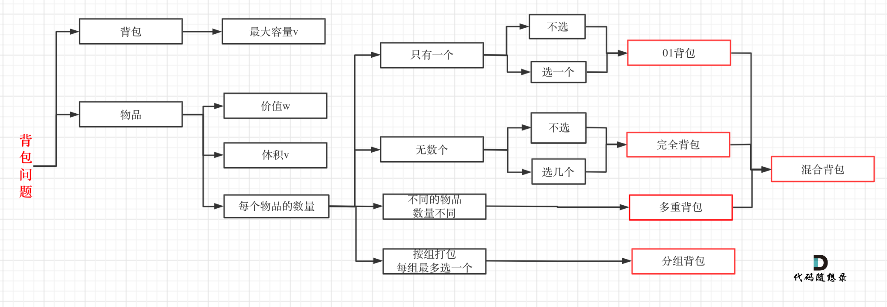

# 动态规划

动态规划的核心思想是：把原问题拆成若干 **重复出现的子问题**，先求小问题，再用小问题的结果推出大问题，从而避免重复计算。

它的本质可以概括成两个词：

- **状态**：`dp[i]` 或 `dp[i][j]` 表示什么。
- **转移**：当前状态如何由前面的状态推出来。

适合用动态规划的问题，通常有两个特征：

- **最优子结构**：大问题的最优解可以由小问题的最优解推出。
- **重叠子问题**：很多子问题会被反复计算。

## 解题步骤

1. **定义状态**  
   先明确 `dp` 数组的含义，例如 `dp[i]` 表示到第 `i` 步的答案。

2. **写出状态转移方程**  
   想清楚“当前结果依赖哪些更小的问题”，例如：`dp[i] = dp[i-1] + dp[i-2]`。

3. **确定初始化**  
   给最小规模的问题赋初值，这是递推的起点。

4. **确定遍历顺序**  
   保证在求当前状态前，它依赖的状态已经算出来。

5. **检查并优化**  
   先手推一遍小样例验证转移是否正确，再看能不能做空间压缩。

## 一句话总结

> 定义状态 -> 找转移方程 -> 设初始值 -> 定遍历顺序 -> 看能否优化空间

## 背包问题

背包问题的核心思想是：在容量有限的条件下，决定“选哪些物品”，让结果最优，或者统计可行方案数。

这类题的关键不只是套公式，而是先想清楚两件事：

- `dp[j]` 或 `dp[i][j]` 表示什么。
- 每个物品是 **只能用一次**，还是 **可以重复使用**。

## 背包解题步骤

1. **定义状态**  
   常见定义是：`dp[j]` 表示容量为 `j` 的背包所能得到的最大价值 / 是否可行 / 方案数。

2. **确定转移方程**  
   本质都是“选 or 不选当前物品”。
   `01` 背包常见写法：`dp[j] = max(dp[j], dp[j-weight[i]] + value[i])`

3. **确定初始化**  
   求最大价值、是否装满、还是统计方案，初始化都不一样。最常见的是先处理 `dp[0]`。

4. **确定遍历顺序**  
   `01` 背包容量要 **倒序遍历**，避免同一物品被重复使用。  
   完全背包容量要 **正序遍历**，因为同一物品可以重复使用。

5. **看题目问的是什么**  
   是求最大值、最小值、是否存在、还是方案数。问题不同，`dp` 含义和初始化也会一起变化。

## 背包一句话总结

> 先定义 `dp` 含义，再区分物品能不能重复选，最后用转移方程和遍历顺序把它写出来
